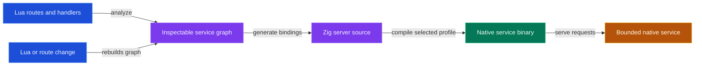
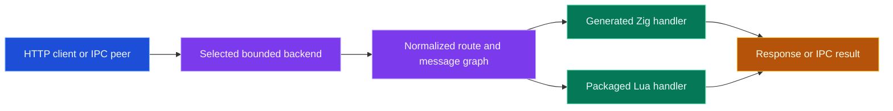
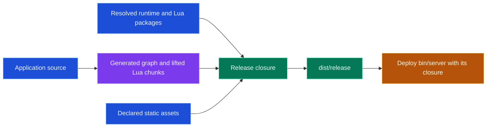

# Meteorite

Meteorite is a Lua-first service compiler for Moonstone projects. Describe an
application in Lua, inspect the normalized service graph, and build a bounded
native service with the runtime closure required by the selected release mode.

## Start a service

Use a global tool when you want `meteorite init` before a project exists:

```sh
moon add --global --tool moonstone/meteorite
moon exec --global meteorite init my-service --hybrid
cd my-service
moon run dev
```

Or keep the generator inside a new project's locked tool closure:

```sh
mkdir my-service
cd my-service
moon init . --empty --name my-service
moon add --tool moonstone/meteorite
moon exec meteorite init . --hybrid
moon run dev
```

`moon init --empty` gives Meteorite ownership of the application scaffold while
Moonstone keeps the tool, runtime, and dependencies isolated from system
packages.

The hybrid starter is ordinary Lua:

```lua
local m = require("meteorite")

local app = m.app({ name = "my-service" })

app:get("/", function(c)
  return c:json({ service = "my-service", runtime = "lua" })
end)

app:get("/health", function(c)
  return c:json({ ok = true })
end)

return app
```

```sh
moon run dev       # watch and live-reload the generated service
moon run build     # build the local server at dist/server
moon run release   # materialize a deployable closure at dist/release
```

## Lua declares, Meteorite compiles

The Lua surface is not the deployed service. It declares facts that Meteorite
normalizes into a graph, uses to generate Zig bindings, and compiles into the
selected native server profile.



Use `moon exec meteorite doctor` when a project needs an explicit check of its
tool, runtime, generated graph, and release configuration.

## Choose a release mode

| Mode | Use it when | Release closure |
| --- | --- | --- |
| Static | Every route and hook can lower to Zig | Native server and static assets; no deployed Lua runtime |
| Hybrid | Lua handlers, Lua modules, or scoped Lua plugins remain at runtime | Native server plus Lua runtime, lifted chunks, required modules, and native Lua modules |

The transport/backend is a deployment choice around the same normalized graph.
It controls admission and serving behavior; it does not change the Lua
application surface into a different framework.

## What happens at runtime

Meteorite keeps the application contract explicit at the boundary. The selected
backend admits bounded work, the graph selects the route or message, and the
normalized handler executes through either generated Zig or the packaged Lua
runtime.



## Deploy the closure, not the source tree

`moon run release` produces a directory meant to survive separation from the
working tree. Hybrid builds package only the Lua pieces the runtime must load;
fixtures, Ballad state, Moonstone environments, generated build state, and
unrelated orbit projects are not part of the deployed service.



The repository `README.md` covers Meteorite's project layout, fixtures,
benchmarks, compiler architecture, and contributor workflow. Use the Moonstone
documentation for guided application, backend, IPC, and release examples.
